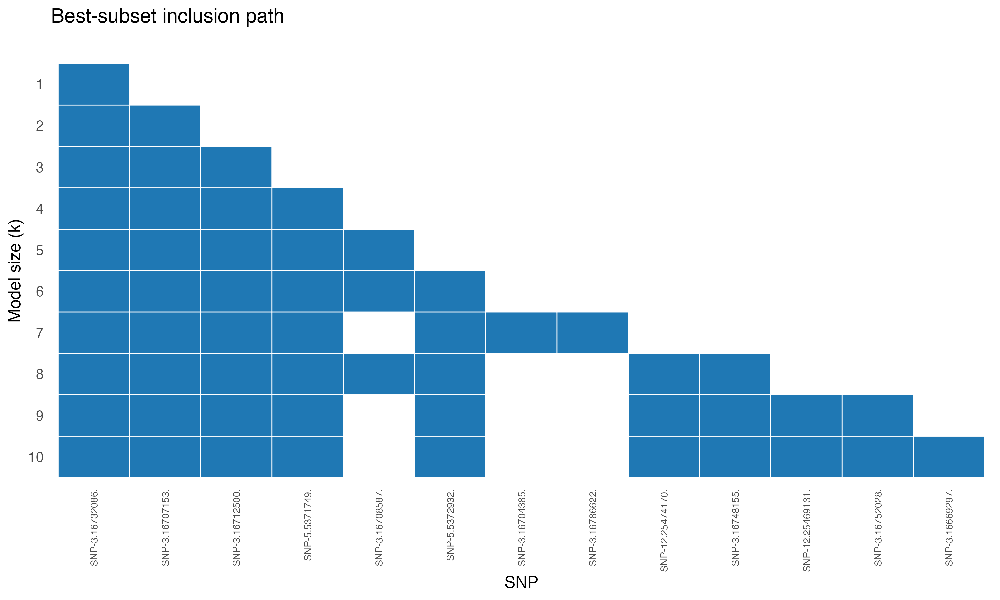
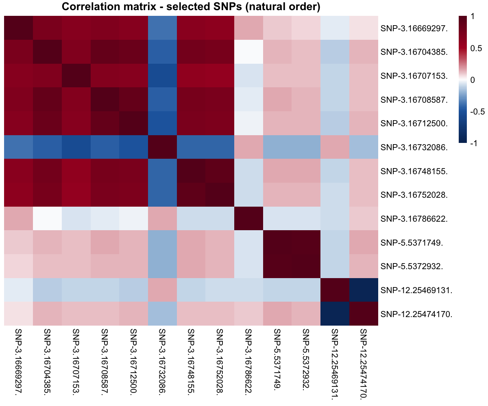

::: {.callout-note appearance="minimal"}
This demo uses pre-computed results — the raw genotype data is too large to ship with this site. The code shows what `combss` was called with; the figures below were produced by that call.
:::

## The biology

Grain length is one of the most economically important traits in rice breeding. The major effect locus has been mapped to the **GS3 gene on chromosome 3**, identified independently by multiple Genome-Wide Association Study (GWAS) groups using thousands of accessions.

Can COMBSS recover this locus *de novo* from raw SNP data, working at the scale of a real GWAS?

## The data

- $n = 1{,}155$ rice accessions (3K Rice Genomes Project subset)
- $p = 158{,}210$ SNPs after QC (MAF filter, call-rate filter)
- Binary response: long-grain vs short-grain (threshold at 6 mm)
- Population stratification corrected via the top principal components of the kinship matrix

Source: McCouch et al. (2016), *3,000 rice genomes project*. Data preparation and QC are described in Mathur, Liquet, Muller, Moka (2026).

## Running COMBSS (sketch)

Once `dataYX` has columns `[y, PCs..., SNP1, SNP2, ..., SNP_p]`:

::: {.panel-tabset group="lang"}

## R

```r
library(combss)

y       <- dataYX$y
x_snps  <- as.matrix(dataYX[, -c(1, 2)])   # drop y and intercept-like column

fit_rice <- combss(x_snps, y,
                   family = "binomial",
                   q = 10)
fit_rice$subset_list
```

## Python

```python
from combss import logistic

y_rice = dataYX["y"].to_numpy()
X_snps = dataYX.drop(columns=["y", "intercept"]).to_numpy()

fit_rice = logistic.model()
fit_rice.fit(X_snps, y_rice, q=10, verbose=False)
print(fit_rice.subset_list)
```

:::

The call returns a nested-looking subset path for $k = 1, \ldots, 10$. We tabulate the selected SNP indices below.

## The selected SNPs

The model at each size $k$:

```{r}
#| label: rice-models
#| echo: false
models <- list(
  k1  = c(43318),
  k2  = c(43307, 43318),
  k3  = c(43307, 43313, 43318),
  k4  = c(43307, 43313, 43318, 66479),
  k5  = c(43307, 43309, 43313, 43318, 66479),
  k6  = c(43307, 43309, 43313, 43318, 66479, 66480),
  k7  = c(43304, 43307, 43313, 43318, 43359, 66479, 66480),
  k8  = c(43307, 43309, 43313, 43318, 43335, 66479, 66480, 157373),
  k9  = c(43307, 43313, 43318, 43335, 43336, 66479, 66480, 157368, 157373),
  k10 = c(43288, 43307, 43313, 43318, 43335, 43336, 66479, 66480, 157368, 157373)
)
knitr::kable(
  data.frame(
    k = seq_along(models),
    Selected = sapply(models, function(s) paste(s, collapse = ", "))
  ),
  align = "ll"
)
```

The single best SNP at $k = 1$ — index **43318** — falls inside the **GS3 gene region on chromosome 3**, the well-known grain-length locus. SNPs **43307, 43313** (chromosome 3 neighbours of GS3) enter at $k = 2, 3$. The cluster around **66479, 66480** (chromosome 5) and **157368, 157373** (chromosome 12) join the model as $k$ grows, picking up secondary loci known from independent GWAS.

## Best-subset inclusion path

The full inclusion-path figure (Figure 4a in the paper):

{fig-align="center" width="90%"}

The earliest-included SNPs are tightly clustered on chromosome 3 — the GS3 locus. Additional chromosomes contribute as $k$ grows.

## Correlation among selected SNPs

```{r}
#| label: rice-corplot
#| echo: false
#| fig-cap: "Correlation matrix of the SNPs selected across all model sizes. Strong off-diagonal blocks reveal linkage disequilibrium within each chromosomal cluster."

```

The block-diagonal structure tells the right biological story: SNPs from the same chromosomal region are in strong linkage disequilibrium, while across chromosomes they are nearly uncorrelated.

## Why this matters

- COMBSS scans 158,210 SNPs in a few minutes on a laptop — the regime where exact best-subset is hopeless and lasso typically returns hundreds of correlated SNPs.
- The single best SNP it returns lands on the **known** functional locus, with no prior biological input.
- For a breeder, *ten SNPs* is a tractable downstream panel; *several hundred* is not.

## Reference

McCouch, S. R. et al. (2016). *Open access resources for genome-wide association mapping in rice*. **Nature Communications** 7, 10532.

::: {.page-nav}
[← Previous: Khan SRBCT](03-khan.qmd)

[Next: Comparisons →](05-comparisons.qmd)
:::
