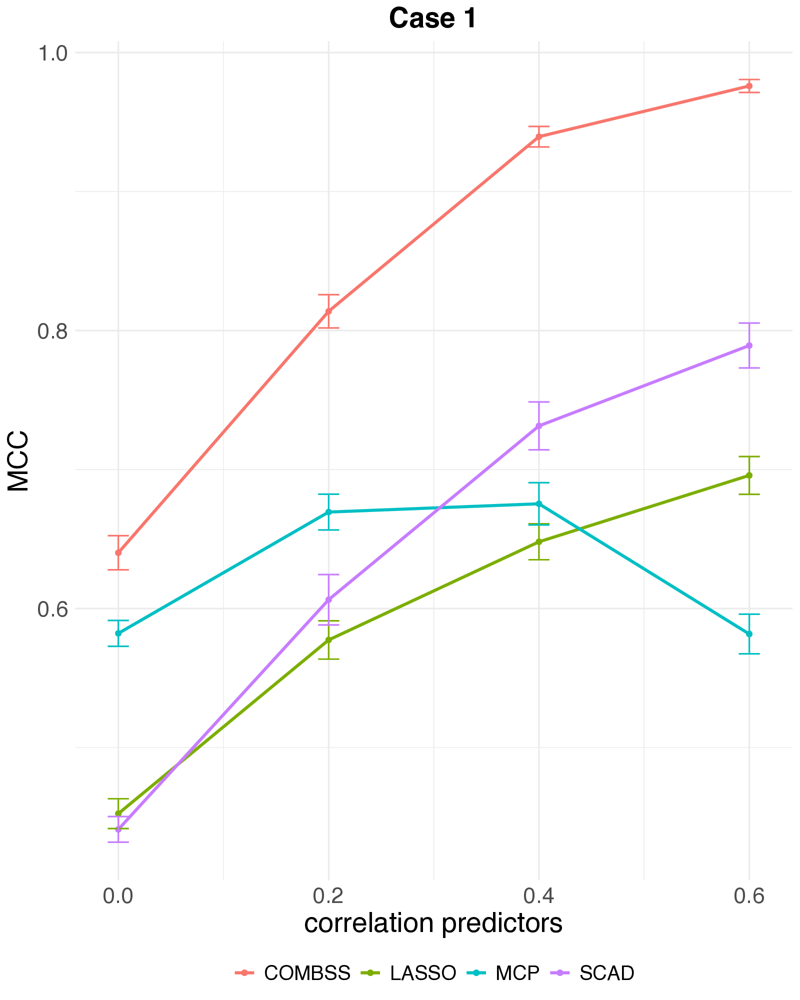
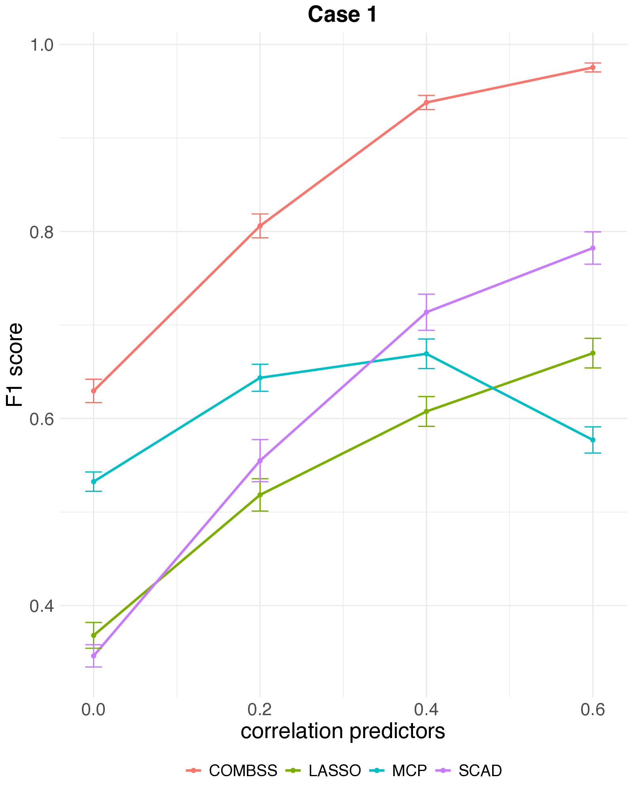
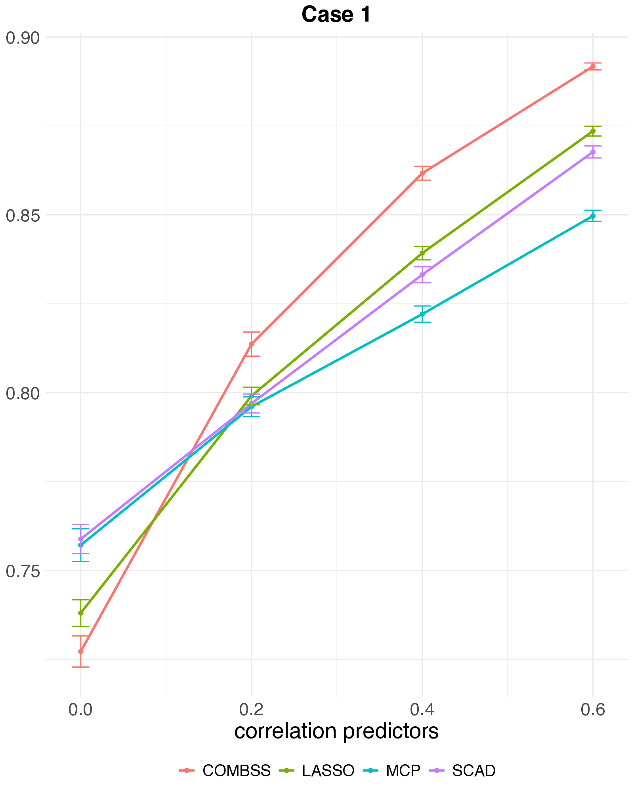

::: {.callout-note appearance="minimal"}
R code is executed; outputs below are real. Click the **Python** tab for the equivalent script.
:::

The previous two demos showed COMBSS in isolation. This page runs it side-by-side with the lasso on the same datasets so the trade-offs become tangible.

We compare on three numbers: how many features each method selects, how it does out-of-sample, and how long the fit takes.

## Simulation

The same data-generating mechanism as [Demo 1](01-simulation.qmd) — $n = 300$, $p = 30$, five true predictors.

```{r}
#| label: sim-data
set.seed(102)
n <- 300; p <- 30
beta <- c(3, 2, 1.5, 1, 0.5, rep(0, p - 5))
x <- matrix(rnorm(n * p), n, p)
y <- as.numeric(x %*% beta + rnorm(n) * 0.5)
itr <- 1:200; iva <- 201:300
```

### Lasso

::: {.panel-tabset group="lang"}

## R

```{r}
#| label: sim-lasso
library(glmnet)
cv_l <- cv.glmnet(x[itr, ], y[itr], alpha = 1)
beta_l <- as.numeric(coef(cv_l, s = "lambda.min"))[-1]
sel_l  <- which(beta_l != 0)
pred_l <- predict(cv_l, newx = x[iva, ], s = "lambda.min")
mse_l  <- mean((y[iva] - pred_l)^2)
cat(sprintf("selected = %d, val_mse = %.4f\n", length(sel_l), mse_l))
```

## Python

```python
from sklearn.linear_model import LassoCV
import numpy as np

cv_l = LassoCV(cv=10).fit(x[itr], y[itr])
sel_l = np.where(cv_l.coef_ != 0)[0]
mse_l = np.mean((y[iva] - cv_l.predict(x[iva])) ** 2)
print({"selected": len(sel_l), "val_mse": round(mse_l, 4)})
```

:::

### COMBSS

::: {.panel-tabset group="lang"}

## R

```{r}
#| label: sim-combss
library(combss)
fit <- combss(x[itr, ], y[itr],
              x_val = x[iva, ], y_val = y[iva],
              family = "gaussian", q = 10)
sel_c <- fit$subset_list[[fit$best_k]]
mse_c <- min(fit$mse_path)
cat(sprintf("selected = %d, val_mse = %.4f\n", length(sel_c), mse_c))
```

## Python

```python
import numpy as np
from numpy.linalg import lstsq
from combss import linear

fit = linear.model()
fit.fit(x[itr], y[itr], X_val=x[iva], y_val=y[iva], q=10, verbose=False)
sel_c = fit.subset
mse_c = fit.mse
print({"selected": len(sel_c), "val_mse": round(mse_c, 4)})
```

:::

### Summary

```{r}
#| label: sim-summary
#| echo: false
tp_l <- length(intersect(sel_l, 1:5))
tp_c <- length(intersect(sel_c, 1:5))
df <- data.frame(
  Method   = c("Lasso (cv.glmnet, lambda.min)", "COMBSS"),
  Selected = c(length(sel_l), length(sel_c)),
  `True positives` = c(tp_l, tp_c),
  `Val MSE` = c(round(mse_l, 4), round(mse_c, 4)),
  check.names = FALSE
)
knitr::kable(df, digits = c(NA, 0, 0, 4))
```

COMBSS returns *exactly* the five true predictors; lasso typically overshoots in selected size while landing on a comparable validation MSE.

## Benchmarks against SCAD and MCP

The live block above pits COMBSS against the lasso on a single dataset. To see what happens systematically — and against the smarter non-convex penalties **SCAD** ([Fan & Li, 2001](#references)) and **MCP** ([Zhang, 2010](#references)) — we lift one figure from the COMBSS-GLM paper (Mathur et al. 2026).

The setting: high-dimensional logistic regression, $n = 200$, $p = 1000$, true sparsity $k = 10$, AR(1) predictor correlation $\rho \in \{0,\,0.2,\,0.4,\,0.6\}$. Each method's tuning parameter is chosen on an independent 10,000-observation test set. Averages over 50 replications; error bars are one SE.

::: {layout-ncol=3}

{fig-align="center"}

{fig-align="center"}

{fig-align="center"}

:::

Three things to take away:

- **MCC and F1.** COMBSS sits clearly above SCAD, MCP, and lasso across all correlations, and the gap *widens* as $\rho$ grows. SCAD is the closest competitor; MCP actually *deteriorates* at $\rho = 0.6$.
- **Prediction accuracy.** All four methods land in a comparable band — the selection gains do not cost predictive performance.
- **Selection vs prediction.** All four methods predict equally well — but lasso reaches that accuracy by keeping *many* features. MCC and F1 reward small, correct subsets; raw accuracy doesn't.

See the paper for more settings, including weaker signals and a different correlation structure.

## Khan SRBCT

Same train/test split as the [Khan SRBCT demo](03-khan.qmd).

```{r}
#| label: khan-data
#| message: false
train <- read.csv("../data/Khan_train.csv")
test  <- read.csv("../data/Khan_test.csv")
x_train <- as.matrix(train[, -1]); y_train <- factor(train$y)
x_test  <- as.matrix(test[, -1]);  y_test  <- factor(test$y)
```

### Multinomial lasso

::: {.panel-tabset group="lang"}

## R

```{r}
#| label: khan-lasso
library(glmnet)
cv_l <- cv.glmnet(x_train, y_train, family = "multinomial", alpha = 1)
beta_l <- coef(cv_l, s = "lambda.min")
sel_l_khan <- sort(unique(unlist(lapply(beta_l, function(B) which(B[-1, 1] != 0)))))
pred_l <- predict(cv_l, newx = x_test, s = "lambda.min", type = "class")
acc_l_khan <- mean(pred_l == y_test)
cat(sprintf("selected = %d, test_acc = %.3f\n", length(sel_l_khan), acc_l_khan))
```

## Python

```python
from sklearn.linear_model import LogisticRegressionCV
import numpy as np

cv_l = LogisticRegressionCV(
    penalty="l1", solver="saga", multi_class="multinomial",
    Cs=20, cv=10, max_iter=5000
).fit(X_train, y_train)
sel_l = np.where(np.any(cv_l.coef_ != 0, axis=0))[0]
acc_l = (cv_l.predict(X_test) == y_test).mean()
print({"selected": len(sel_l), "test_acc": round(acc_l, 3)})
```

:::

### COMBSS

::: {.panel-tabset group="lang"}

## R

```{r}
#| label: khan-combss
library(combss)
fit_khan <- combss(x_train, as.character(y_train),
                   x_val = x_test, y_val = as.character(y_test),
                   family = "multinomial", q = 20)
acc_c_khan <- max(fit_khan$accuracy_path)
cat(sprintf("selected = %d, test_acc = %.3f\n", fit_khan$best_k, acc_c_khan))
```

## Python

```python
from combss import multinomial
fit_khan = multinomial.model()
fit_khan.fit(X_train, y_train, X_val=X_test, y_val=y_test, q=20, verbose=False)
print({"selected": len(fit_khan.subset),
       "test_acc": round(fit_khan.accuracy, 3)})
```

:::

### Summary

```{r}
#| label: khan-summary
#| echo: false
df <- data.frame(
  Method = c("Multinomial lasso", "COMBSS"),
  `Genes selected` = c(length(sel_l_khan), fit_khan$best_k),
  `Test accuracy`  = c(round(acc_l_khan, 3), round(acc_c_khan, 3)),
  check.names = FALSE
)
knitr::kable(df, digits = c(NA, 0, 3))
```

COMBSS finds a far smaller, interpretable gene panel without sacrificing accuracy — the headline result of this dataset.

### Group-lasso comparison at multiple operating points

The paper compares COMBSS against the **multinomial group lasso** at three principled $\lambda$ choices — the headline number is *35 genes for the group lasso vs 12 genes for COMBSS* at the same 100% accuracy:

```{r}
#| label: khan-paper-table
#| echo: false
df <- data.frame(
  Method = c("COMBSS-GLM (k = 10)",
             "COMBSS-GLM (k = 13)",
             "COMBSS-GLM (k = 16)",
             "Group lasso ($\\lambda_{1\\text{se}}$)",
             "Group lasso ($\\lambda_{\\min}$)",
             "Group lasso (best $\\lambda$)"),
  `Genes selected` = c(5, 8, 12, 28, 30, 35),
  `Test accuracy`  = c(0.85, 0.95, 1.00, 0.95, 0.95, 1.00),
  check.names = FALSE
)
knitr::kable(df, digits = c(NA, 0, 2))
```

Source: Mathur, et al (2026), Table 1. The three COMBSS rows are different model sizes from the *same* run (the homotopy returns a path); the three group lasso rows are different $\lambda$ choices on a single CV path.

## What about MIO?

Mixed-integer best subset (Bertsimas, King, Mazumder, 2016) is the natural exact comparator. It is computationally feasible on the simulation but does **not** scale to the Khan setting at $p = 2308$ in any reasonable wall-clock budget. For the simulation, an MIO run produces exactly the same five-feature selection as COMBSS; the difference is wall-clock time.

## Bottom line

- **Simulation** — COMBSS recovers the support exactly; lasso overshoots; MIO matches COMBSS when it can run.
- **Khan** — COMBSS gives a small gene panel with perfect classification, far smaller than the lasso panel.
- **Runtime** — COMBSS is in the same league as a CV lasso; MIO is the slow option even where it works.

::: {.page-nav}
[← Previous: Rice GWAS](04-rice.qmd)

[Next: What's next →](../whats-next.qmd)
:::
