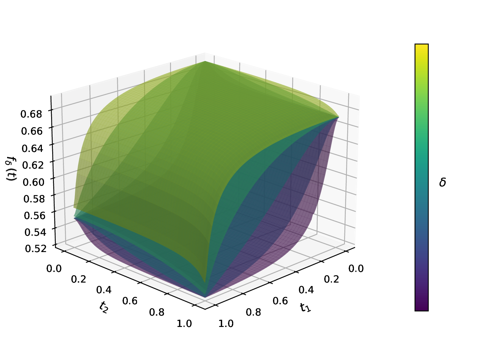

## Recall: the discrete problem

From the [Sparse GLM](../motivation/01-sparse-glm.qmd) page, the problem we want to solve is

$$
\begin{aligned}
&\min_{\beta_0 \in \mathbb{R},\; \boldsymbol{\beta} \in \mathbb{R}^p}\;\; -\tfrac{1}{n}\,\ell(\beta_0, \boldsymbol{\beta}) \\
&\text{subject to} \quad \|\boldsymbol{\beta}\|_0 = k.
\end{aligned}
$$

The pain is the $\ell_0$ constraint: it forces a search over $\binom{p}{k}$ discrete supports. COMBSS replaces it by a continuous relaxation.

## Reparameterising the support

Introduce an auxiliary vector $\boldsymbol{t} \in [0, 1]^p$ — a continuous proxy for the binary indicator $\boldsymbol{s} \in \{0, 1\}^p$. In the relaxed problem, the data sees the **Hadamard product**

$$
\boldsymbol{t} \odot \boldsymbol{\beta}
\;=\; \bigl(\,t_1 \beta_1,\; t_2 \beta_2,\; \ldots,\; t_p \beta_p\,\bigr),
$$

so that feature $j$ is *scaled* by $t_j$:

- $t_j = 1$: feature $j$ is **fully in** (coefficient $\beta_j$ used as-is).
- $t_j = 0$: feature $j$ is **out** (effective coefficient is zero, regardless of $\beta_j$).
- $0 < t_j < 1$: a continuous "partial inclusion".

Vertices of the hypercube $[0,1]^p$ correspond exactly to discrete supports. We run COMBSS for a fixed model size $k$ (sweeping $k = 1, 2, \ldots$ along the path), so the cardinality constraint $\sum s_j = k$ relaxes to the simplex slice

$$
\boldsymbol{t} \;\in\; \mathcal{T}_k \;=\; \Bigl\{\, \boldsymbol{t} \in [0,1]^p \;:\; \textstyle\sum_{j=1}^{p} t_j = k \,\Bigr\},
$$

a polytope whose vertices are exactly the binary $k$-supports.

## The relaxed objective

For a curvature parameter $\delta > 0$, define

$$
\boxed{\;\;
f_{\delta}(\boldsymbol{t})
\;=\;
\min_{\beta_0,\,\boldsymbol{\beta}}\;
\Biggl[
-\tfrac{1}{n}\,\ell\bigl(\beta_0,\;\boldsymbol{t} \odot \boldsymbol{\beta}\bigr)
\;+\; \delta \sum_{j=1}^{p} \bigl(1 - t_j^{2}\bigr)\,\beta_j^{2}
\Biggr].
\;\;}
$$

Two pieces:

- **GLM loss** evaluated at the *effective* coefficients $\boldsymbol{t} \odot \boldsymbol{\beta}$.
- **Curvature penalty** $\delta \sum_j (1 - t_j^2) \beta_j^2$: weights are large when $t_j$ is small, pulling those $\beta_j$ toward zero; weights vanish at the vertices ($t_j \in \{0, 1\}$).

The inner problem in $\boldsymbol{\beta}$ (with $\boldsymbol{t}$ fixed) is a **ridge-penalised GLM** — closed-form for Gaussian, one `glmnet` call for binomial/multinomial.

The outer problem in $\boldsymbol{t}$ is smooth on the cardinality polytope $\mathcal{T}_k$.

## Properties of the relaxed objective

What does $f_\delta(\boldsymbol{t})$ look like as we vary $\delta$? Two visualisations make the shape concrete — one in 1D and one in 2D.

### One feature ($p = 1$)

The simplest case: a single predictor with a Gaussian response. The relaxed objective is a function of one scalar $t \in [0, 1]$.

```{r}
#| label: relaxation-1d
#| echo: false
#| fig-width: 7
#| fig-height: 4
#| fig-cap: "The relaxed objective $f_\\delta(t)$ for a single-feature Gaussian regression, plotted over $t \\in [0, 1]$ for several values of $\\delta$. The endpoints are fixed: $f_\\delta(0)$ equals the null-model loss; $f_\\delta(1)$ equals the OLS-fit loss. As $\\delta$ grows, the curve becomes more peaked toward the vertex $t = 1$."

set.seed(2026)
n <- 100
x <- rnorm(n)
beta_true <- 1.5
y <- beta_true * x + 0.6 * rnorm(n)

# Centre to drop intercept
x <- x - mean(x); y <- y - mean(y)
Sxx <- sum(x^2); Sxy <- sum(x * y); Syy <- sum(y^2)

# Inner FOC: minimise (1/2n) sum (y - t*beta*x)^2 + delta*(1 - t^2)*beta^2
# Optimum: beta_hat(t) = (t/n) Sxy / ((t^2/n) Sxx + 2 delta (1 - t^2))
#                     = t Sxy / (t^2 Sxx + 2 n delta (1 - t^2))
fhat <- function(t, delta) {
  beta <- t * Sxy / (t^2 * Sxx + 2 * n * delta * (1 - t^2))
  resid2 <- Syy - 2 * t * beta * Sxy + t^2 * beta^2 * Sxx
  resid2 / (2 * n) + delta * (1 - t^2) * beta^2
}

tt <- seq(0.001, 1, length.out = 400)
deltas <- c(0.0001, 0.001, 0.01, 0.1, 1)
cols <- c("#c8e0d8", "#9ec5b9", "#5dac9b", "#2a9d8f", "#0b3a35")

# Endpoint values (same for all delta, since the curvature penalty vanishes
# at t in {0, 1}).
f0 <- Syy / (2 * n)                       # null-model loss
f1 <- (Syy - Sxy^2 / Sxx) / (2 * n)       # OLS-fit loss

par(mar = c(4, 4, 1, 1))
ymax <- f0 * 1.08
plot(NA, xlim = c(0, 1), ylim = c(0, ymax),
     xlab = expression(t), ylab = expression(f[delta](t)),
     yaxs = "i")

# Endpoint bars at t = 0 (null model) and t = 1 (OLS)
bar_w <- 0.02 / 3
rect(-bar_w, 0, bar_w, f0, col = "#c0392b", border = NA)
rect(1 - bar_w, 0, 1 + bar_w, f1, col = "#c0392b", border = NA)
text(0,  f0, sprintf("%.2f", f0), pos = 3, offset = 0.3, cex = 0.85, col = "#c0392b")
text(1,  f1, sprintf("%.2f", f1), pos = 3, offset = 0.3, cex = 0.85, col = "#c0392b")

for (i in seq_along(deltas)) {
  lines(tt, fhat(tt, deltas[i]), col = cols[i], lwd = 2.4)
}
abline(v = c(0, 1), lty = 3, col = "grey60")
legend("topright",
       legend = sapply(rev(deltas), function(d) bquote(delta == .(d))),
       col = rev(cols), lwd = 2.4, bty = "n", cex = 0.95)
```

Three things to read off:

- **Endpoints are fixed**: $f_\delta(0)$ = the loss when no feature is in (null model); $f_\delta(1)$ = the loss when the feature is fully in (OLS fit). Neither depends on $\delta$.
- **Small $\delta$**: The curve is nearly convex.
- **Large $\delta$**: The curve becomes *concave on the interior*, with its minimum at the vertex $t = 1$.

The homotopy in $\delta$ — gradually increasing $\delta$ during optimisation — uses the small-$\delta$ smooth landscape for navigation and the large-$\delta$ peaked landscape to push $\boldsymbol{t}$ to a vertex (= a discrete subset). See [Frank-Wolfe](02-frank-wolfe.qmd) for the schedule.

### Two features ($p = 2$)

In 2D the same effect plays out as a surface deforming with $\delta$. The figure below (from Mathur, Liquet, Muller, Moka 2026) shows $f_\delta(\boldsymbol{t})$ over $[0, 1]^2$ for logistic regression at three values of $\delta$:

{fig-align="center" width="92%"}

The same story as the 1D case, now on a square. As $\delta$ grows, the surface becomes spiky at the vertices, and the algorithm is forced toward a discrete support.

## Two guarantees

Two results anchor $f_\delta$ to the original discrete problem (Mathur, et al. 2026).

**1. Corner equivalence at every $\delta$.** At any binary vertex $\boldsymbol{s} \in \{0,1\}^p$,

$$
f_\delta(\boldsymbol{s})
\;=\;
\min_{\substack{\beta_0,\,\boldsymbol{\beta} \\ \beta_j = 0\,\text{ if }\,s_j = 0}}\;\;
-\tfrac{1}{n}\,\ell(\beta_0, \boldsymbol{\beta})
\qquad \text{for every } \delta > 0.
$$

The penalty $\delta(1 - s_j^2)\beta_j^2$ is zero when $s_j = 1$, and pins $\beta_j = 0$ when $s_j = 0$. At the corners, $f_\delta$ is the original sparse-GLM loss restricted to the support encoded by $\boldsymbol{s}$ — no relaxation error.

**2. Minimum at an optimal corner for large $\delta$.** There exists $\delta^\star > 0$ such that for every $\delta \ge \delta^\star$, $f_\delta$ is concave on $\mathcal{T}_k$. Since a concave function on a polytope attains its minimum at a vertex,

$$
\arg\min_{\boldsymbol{t} \in \mathcal{T}_k} f_\delta(\boldsymbol{t}) \;\in\; \{0,1\}^p,
$$

and by corner equivalence that vertex solves the original $\ell_0$-constrained sparse-GLM problem exactly.

Together they motivate the **homotopy in $\delta$**: start small for a smooth landscape, end large to land on a discrete solution. The outer optimisation along the way needs the gradient $\nabla f_\delta$ — derived next on the [Frank-Wolfe](02-frank-wolfe.qmd) page.

::: {.page-nav}
[← Previous: COMBSS (our method)](../motivation/04-combss.qmd)

[Next: Frank-Wolfe →](02-frank-wolfe.qmd)
:::
