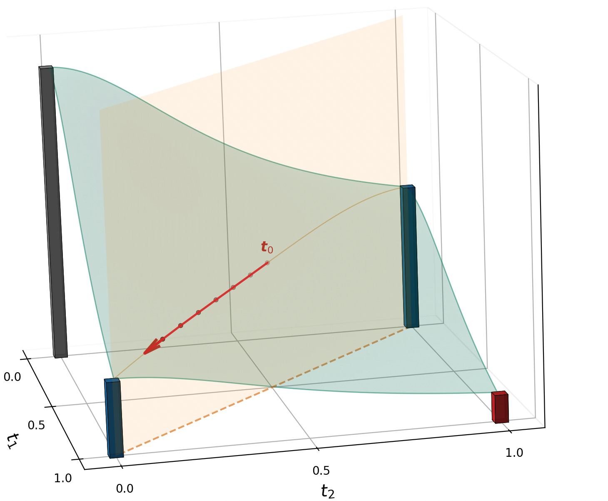
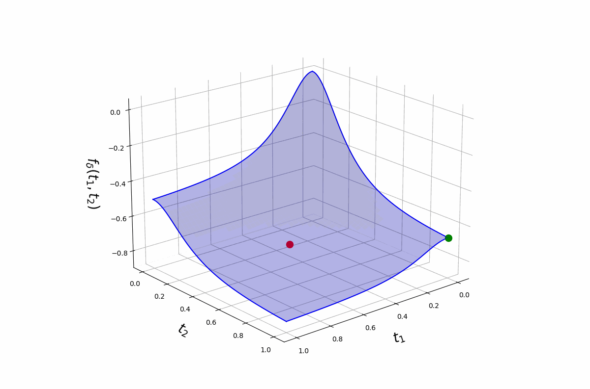

## Envelope gradient

The outer problem 
$$\min_{\boldsymbol{t} \in \mathcal{T}_k} f_\delta(\boldsymbol{t}), \qquad \mathcal{T}_k \;=\; \Bigl\{\, \boldsymbol{t} \in [0,1]^p \;:\; \textstyle\sum_{j=1}^{p} t_j = k \,\Bigr\},$$ 
is a smooth optimisation, but $f_\delta$ is itself the value of an *inner* minimisation over $\boldsymbol{\beta}$: recall that 
$$
f_{\delta}(\boldsymbol{t})
\;=\;
\min_{\beta_0,\,\boldsymbol{\beta}}\;
\Biggl[
-\tfrac{1}{n}\,\ell\bigl(\beta_0,\;\boldsymbol{t} \odot \boldsymbol{\beta}\bigr)
\;+\; \delta \sum_{j=1}^{p} \bigl(1 - t_j^{2}\bigr)\,\beta_j^{2}
\Biggr].
$$

Differentiating it directly would mean tracking how $\hat{\boldsymbol{\beta}}(\boldsymbol{t})$ moves as $\boldsymbol{t}$ changes — a chain through the inner solver.

The **envelope theorem** (Danskin) sidesteps this. Because $\hat{\boldsymbol{\beta}}(\boldsymbol{t})$ is optimal for the inner problem, those derivative terms cancel, and the gradient of $f_\delta$ has a closed form in terms of $\hat{\boldsymbol{\beta}}(\boldsymbol{t})$ alone:

$$
\boxed{\;\;
\bigl[\nabla f_{\delta}(\boldsymbol{t})\bigr]_j
\;=\; -\,\frac{2\,\delta\,\hat\beta_j(\boldsymbol{t})^{2}}{t_j}.
\;\;}
$$

In practice, one `glmnet` call returns the effective coefficients $\hat{\boldsymbol{\xi}}(\boldsymbol{t}) = \boldsymbol{t} \odot \hat{\boldsymbol{\beta}}(\boldsymbol{t})$ (the reparameterisation that makes the inner problem a standard ridge GLM). We then recover $\hat{\beta}_j(\boldsymbol{t}) = \hat{\xi}_j(\boldsymbol{t}) / t_j$ before plugging into the gradient. No implicit differentiation through the inner solver.

## The Homotopy Frank-Wolfe iteration

At iterate $\boldsymbol t^{(i)}$ with scheduled curvature $\delta_i$:

1. **Linear minimisation oracle (LMO)**:

$$
\boldsymbol s^{(i)} \;\in\;
\arg\min_{\boldsymbol u \in \mathcal{T}_k}
\langle \nabla f_{\delta_i}(\boldsymbol t^{(i)}),\,\boldsymbol u\rangle
\;\;\Longleftrightarrow\;\;
\boldsymbol s^{(i)} = \text{vertex with the $k$ smallest entries of } \nabla f_{\delta_i}(\boldsymbol t^{(i)}).
$$

2. **Step**: $\boldsymbol t^{(i+1)} = (1 - \alpha)\,\boldsymbol t^{(i)} + \alpha\,\boldsymbol s^{(i)}.$

3. **Iterate** until $\boldsymbol t^{(i)}$ converges to a vertex.

## Why no projections

The cardinality polytope is a *combinatorial* set; projecting onto it is itself a hard problem. Frank-Wolfe avoids the projection — every step just requires the linear minimisation oracle, which is a sort.

## Initialisation and the homotopy fix

Why does the iteration need a *schedule* $\delta_i$ at all? Because a fixed $\delta$ doesn't work.

**Fixed $\delta$ traps initialisation.** Running the iteration above at a single, large $\delta$ does drive $\boldsymbol{t}$ to a corner. However, due to the  concave landscape of the objective at large $\delta$, the corner you land on highly depends on where you start.

{fig-align="center" width="55%"}

**Homotopy fixes it.** Start at small $\delta_0$ where $f_\delta$ is (near) convex, so descent is well-behaved everywhere; then grow $\delta$ along a schedule $\delta_0 < \delta_1 < \cdots$. The landscape deforms continuously from smooth to peaked-at-vertices, sliding the iterate into an *optimal* corner rather than the nearest one.

{fig-align="center" width="95%"}

## The $\delta$ schedule

Two practical questions: what schedule, and how large does $\delta$ ultimately need to be?

**Geometric growth, warm-started.** A geometric ladder works well:

$$
\delta_{i+1} \;=\; r\,\delta_i, \qquad r > 1, \qquad i = 0, 1, \ldots, N-1.
$$

Each Frank-Wolfe step is warm-started from the previous $\boldsymbol t^{(i)}$, so the iterate drifts smoothly along the deforming landscape rather than restarting from scratch at every $\delta_i$.

**Concavity threshold (Mathur, Liquet, Muller, Moka 2026).** There is an explicit $\delta^\star$ above which $f_\delta$ is concave on $[0, 1]^p$, so every minimiser on the polytope $\mathcal{T}_k$ is a binary vertex:

$$
\delta^\star_{\text{logistic}} \;=\; \frac{\nu_{\max}}{8n},
\qquad
\delta^\star_{\text{multinomial}} \;=\; \frac{\nu_{\max}}{4n},
$$

where $\nu_{\max}$ is the largest eigenvalue of $X_S^\top X_S$ on a feasible support $S$. The schedule only needs to terminate at $\delta_N \ge \delta^\star$.

<!--
## The $k$-sweep

For a *path* of subset sizes, loop $k = 1, 2, \ldots, q$ and warm-start each $k$ from the solution at $k-1$. One sweep returns the full sequence $S_1, S_2, \ldots, S_q$ for the price of a single tight homotopy at $k = q$.
-->

## Why the schedule converges

Two results make the homotopy work — one classical, one tailored to our approximate algorithm.

::: {.callout-note title="1. Continuity in $\delta$ (Berge's Maximum Theorem)"}
If $\delta$ changes a little, the minimiser of $f_\delta$ also changes a little — it cannot jump to a different corner of the polytope. So warm-starting the next Frank-Wolfe step from the previous iterate is reliable: the new optimum sits *near* where we already are.
:::

::: {.callout-tip title="2. Approximate solves are good enough (Mathur et al. 2026)"}
The inner ridge-GLM is solved to a tolerance, and the Frank-Wolfe step is approximate — neither is exact. This is fine: along the schedule, the approximate iterates concentrate at a binary corner of the polytope, giving a feasible discrete solution to the sparse-GLM problem. In the asymptotic limit (continuous schedule, vanishing tolerance) that corner is a global optimum; for the finite schedule we actually run, the result is a high-quality binary subset rather than a certified global one.
:::

The first result says the *path* is safe; the second says we *land at a corner* — and in the limit, the right one.

<!--
## Vertex-approach guarantee

$$
\|\boldsymbol t^{(i)} - \boldsymbol s^*\|_\infty
\;\le\;
(1 - \alpha)^i \,\|\boldsymbol t^{(0)} - \boldsymbol s^*\|_\infty.
$$

Linear convergence to the chosen vertex once the LMO direction settles.
-->
## Where to next

See it work — in code, on real data:

- [Linear simulation](../demos/01-simulation.qmd)
- [HD logistic simulation](../demos/02-simulation-hd.qmd)
- [Khan SRBCT](../demos/03-khan.qmd)
- [Rice GWAS](../demos/04-rice.qmd)
- [Comparisons](../demos/05-comparisons.qmd)

::: {.page-nav}
[← Previous: Boolean relaxation](01-relaxation.qmd)

[Next: Linear simulation →](../demos/01-simulation.qmd)
:::
